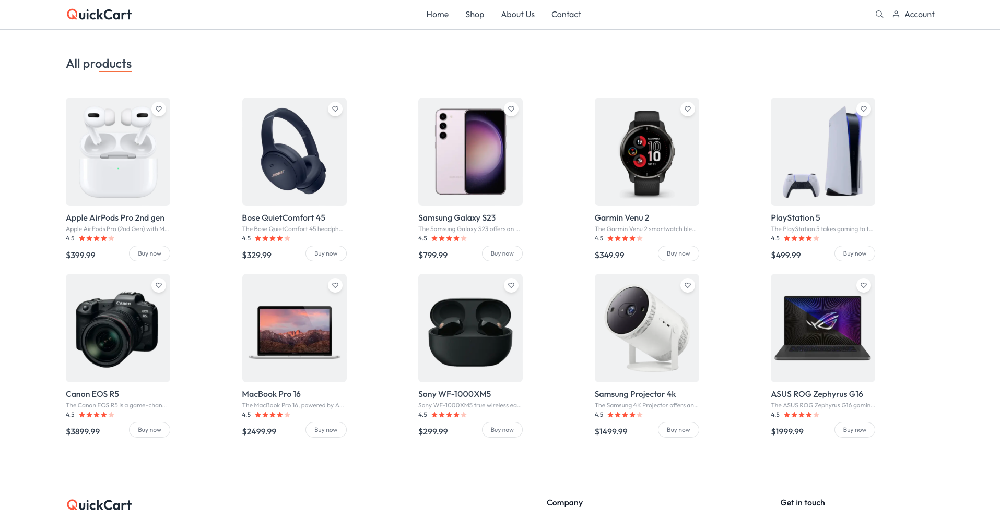
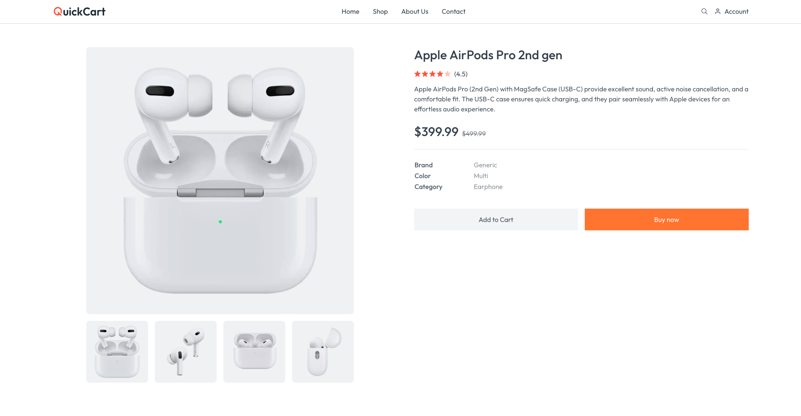
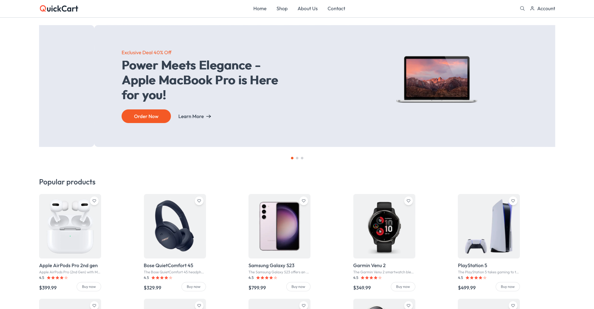

# 📌 QuickCart – Full Stack E-Commerce Website

## 🚀 Project Overview
QuickCart is a full-stack e-commerce platform designed to provide a smooth online shopping experience. It features product browsing, cart management, secure checkout, and an admin dashboard for managing products and orders.


This is a [Next.js](https://nextjs.org) project bootstrapped with [create-next-app](https://github.com/vercel/next.js/tree/canary/packages/create-next-app).

## Getting Started

First, run the development server:

Bash

npm run dev
 or
yarn dev
 or
pnpm dev
 or
bun dev

## 📸 Screenshots

### 🛒 Product Listing


### 🛒 Single Product


### 🏠 Homepage



Open [http://localhost:3000](http://localhost:3000) with your browser to see the result.

You can start editing the page by modifying app/page.js. The page auto-updates as you edit the file.

This project uses [next/font](https://nextjs.org/docs/app/building-your-application/optimizing/fonts) to automatically optimize and load [Geist](https://vercel.com/font), a new font family for Vercel.

## Learn More

To learn more about Next.js, take a look at the following resources:

- [Next.js Documentation](https://nextjs.org/docs) - learn about Next.js features and API.
- [Learn Next.js](https://nextjs.org/learn) - an interactive Next.js tutorial.

You can check out [the Next.js GitHub repository](https://github.com/vercel/next.js) - your feedback and contributions are welcome!

## Deploy on Vercel

The easiest way to deploy your Next.js app is to use the [Vercel Platform](https://vercel.com/new?utm_medium=default-template&filter=next.js&utm_source=create-next-app&utm_campaign=create-next-app-readme) from the creators of Next.js.

Check out our [Next.js deployment documentation](https://nextjs.org/docs/app/building-your-application/deploying) for more details.
nextjs.org
Next.js by Vercel - The React Framework
Production grade React applications that scale. The world's leading companies use Next.js by Vercel to build static and dynamic websites and web applications.


### 🔑Default Credentials
- **Admin Email:** admin@example.com  
- **Password:** password

## ✨ Features & Functionality
- 👤 User authentication (JWT) & role-based access.
- 🛍 Product listing, searching, filtering, and management.
- 🛒 Shopping cart functionality with quantity updates.
- 📦 Order creation & history tracking.
- 📤 Image uploads stored in uploads/.
- 📱 Responsive frontend UI.

## 📊 Data Handling
- ✅MongoDB database for users, products, and orders
- ✅Mongoose schemas for structured data modeling
- ✅REST APIs for handling client requests

## 🧠 User Experience & Design
- ✅Intuitive product browsing and filtering
- ✅Responsive layout using modern design principles
- ✅Interactive cart and checkout pages

## 🔐 Authentication & Security
- ✅JSON Web Tokens (JWT) for authentication
- ✅bcrypt for password encryption
- ✅Protected routes for admin and user roles

## 🛠 Tech Stack
## Frontend
- Built with React.js
- State management with Redux
- Axios for API requests

## Backend
- Node.js + Express.js
- MongoDB with Mongoose ORM
- RESTful API structure

## Tools and Libraries
- React, Redux, Axios, React Router
- Express, Mongoose, bcrypt, JWT
- Multer for image uploads
- dotenv for environment management

## 📂Repositories
- **Frontend (Client-side):** [QuickCart Frontend](https://github.com/tonni59/QuickCart-Client-Side)  
- **Backend (Server-side):** [QuickCart Backend](https://github.com/tonni59/QuickCart-Server-Side)

---

## ⚙️ Setup & Installation

### ✅ Prerequisites
- Node.js (>= 14)
- MongoDB installed or cloud instance (MongoDB Atlas)
- Git

### 🔧 Client Setup
```bash
### Clone repository
git clone https://github.com/tonni59/QuickCart-Client-Side.git
cd QuickCart-Client-Side

# Install dependencies
npm install

# Create a .env file in root and configure environment variables
# Example:
REACT_APP_API_URL=http://localhost:5000

# Start development server
npm start
```

### 🖥️ Server Setup
```bash
# Clone repository
git clone https://github.com/tonni59/QuickCart-Server-Side.git
cd QuickCart-Server-Side

# Install dependencies
npm install

# Create a .env file in root and configure variables
# Example:
MONGO_URI=mongodb://localhost:27017/quickcart
JWT_SECRET=yourSecretKey
PORT=5000

# Start the server
npm run dev
```

### 📦Server NPM Dependencies

- **Backend: express, mongoose, bcryptjs, jsonwebtoken, dotenv, multer, nodemon
- **Frontend: react, react-router-dom, axios, tailwindcss
